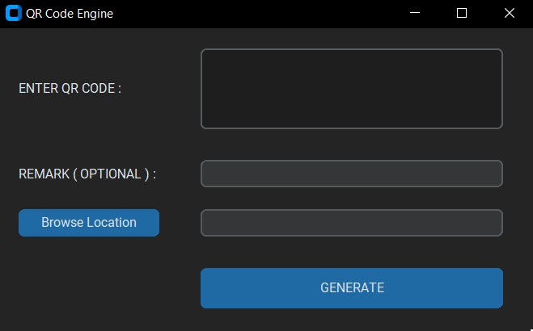
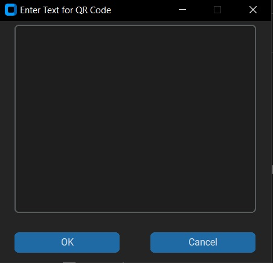
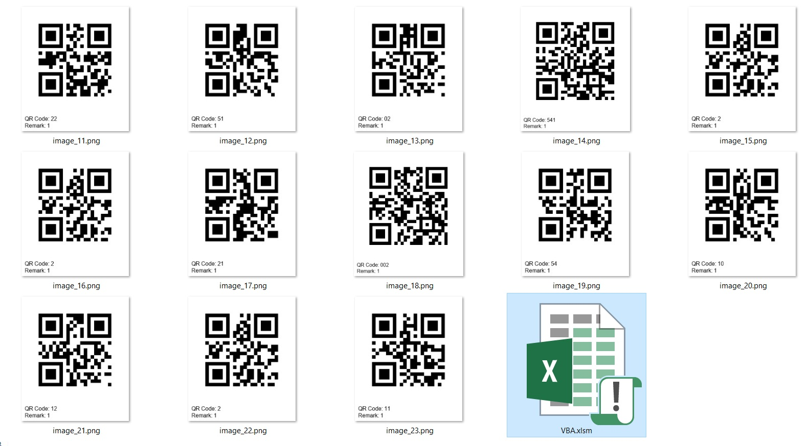
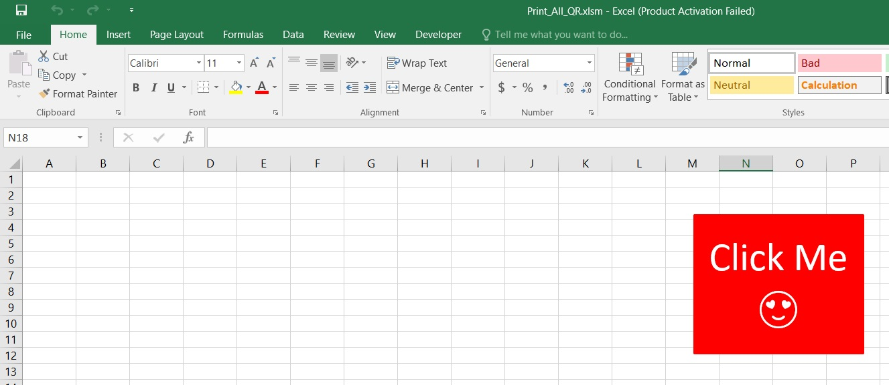
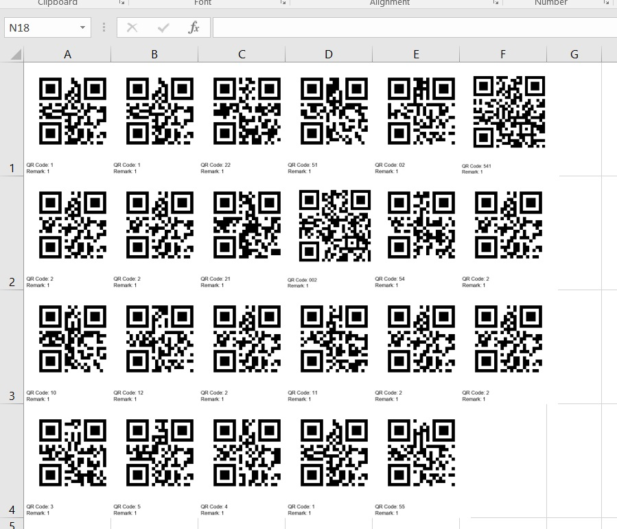

# <u>QR code Engine </u>
# <u>USER INSTRUCTION MANUAL </u>

 

**QR Code Generator**

This program will generate multiple QR codes based on user input and display them one by one.

**Requirements:**

* User inputs information to generate QR code
* Program generates QR code line by line
* Multiple QR codes can be generated

**How it works:**

1. The user inputs their desired QR code information (e.g., text, URL, etc.)
2. The program breaks down the input into individual lines
3. Each line is processed to generate a separate QR code
4. The generated QR codes are displayed one by one in the textbox

**Example use cases:**

* Generating multiple QR codes for different business promotions
* Creating a dataset of QR codes with unique information
* Automating QR code generation for a large-scale project

**Remark (Optional):**
* As name states this is an optional.
* If you do not write any remark still this will generate the QR code.

**Browse:**
* Write the location where you want to save the Generated QR code.

**Generate:**
* This action will generate the QR code.

# How to use:
This is explaination this with example. 
**Case 1 :**

* ENTER QR CODE : for example " 123ABC789" 
* REMARK(OPTIONAL) : Do not pass any argument 
* BROWSE LOCATION :  your/save/location/path
* GENERATE : It will generate the all QR code and save at browse location with empty remark.

**Case 2:**
* ENTER QR CODE : for example " 123ABC789" 
* REMARK(OPTIONAL) : for example write 1 
* BROWSE LOCATION :  your/save/location/path
* GENERATE : It will generate the all QR code and save at browse location code with remark 1.

**Case 3:**
* ENTER QR CODE : for example
123ABC789 
321ABC789 
435ABC789 
899ABC789 
* REMARK(OPTIONAL) : for example write 1 
* BROWSE LOCATION :  your/save/location/path
* GENERATE : It will generate the all QR code and save at browse location code with remark 1.

**NOTE:**
* Double click on ENTER QR CODE textbox new window will 
where also can pass the QR code information.

### Optional :
You can use Excel VBA script to put all the QR code in one excel file so you can print.  
**How to use VBA file**
* Step 1: First places VBA file where all QR code images save.

* Step 2: Open the VBA.xlsm file, Make sure you enable VBA.

* Step 3: After click the <strong>Click me</strong>result will be like in the picture below which you can print.

